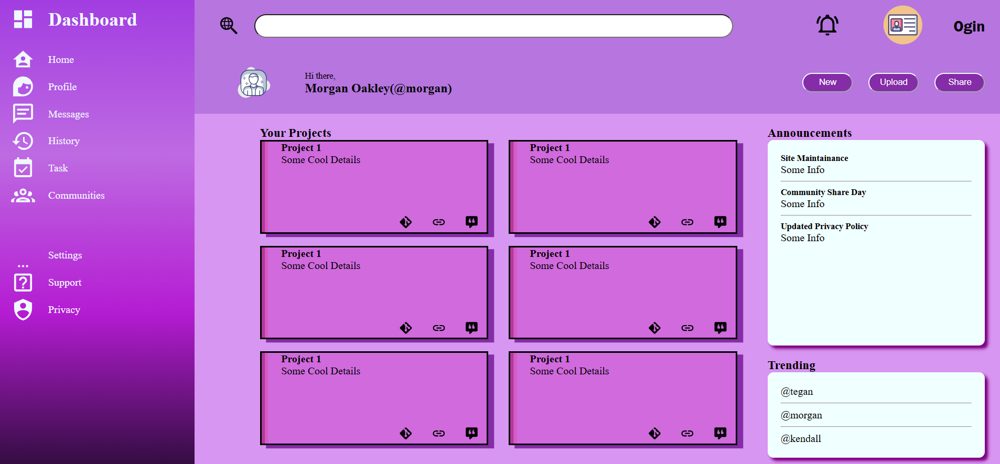

# Admin-Dashboard

## [Live Demo](https://gunjanjaiswal.github.io/admin-dashboard/)

Admin Dashboard created using CSS Grid Layout. Feel free to give me reviews

---

### 🛠 Technologies Used

&nbsp;&nbsp;

### 💬 Feedback

If you'd like to leave feedback or suggestions, feel free to drop a comment in the [Discussions](https://github.com/gunjanjaiswal/admin-dashboard/discussions) section.

Your thoughts are appreciated!

